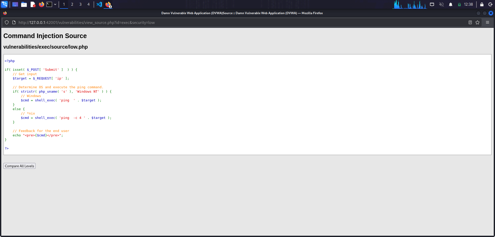
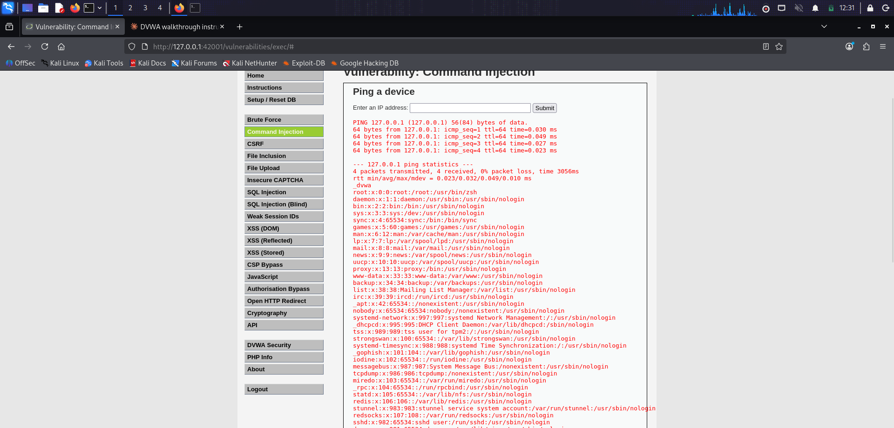
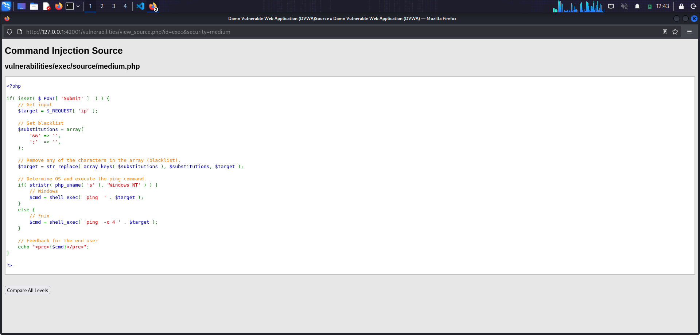
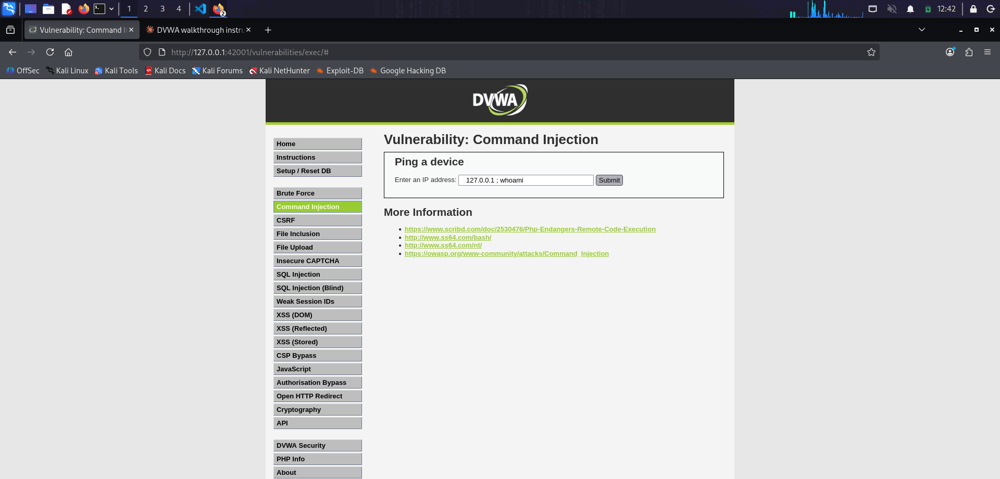
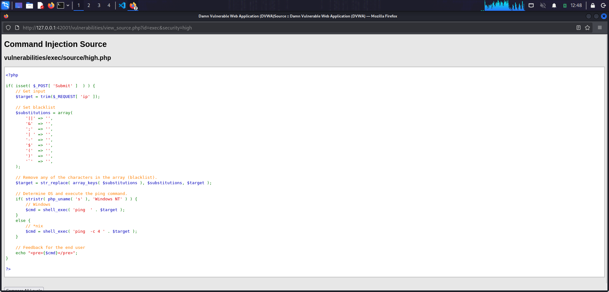
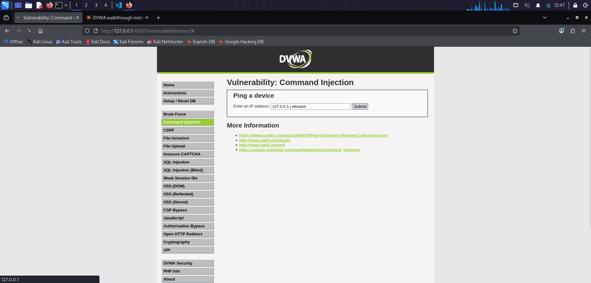
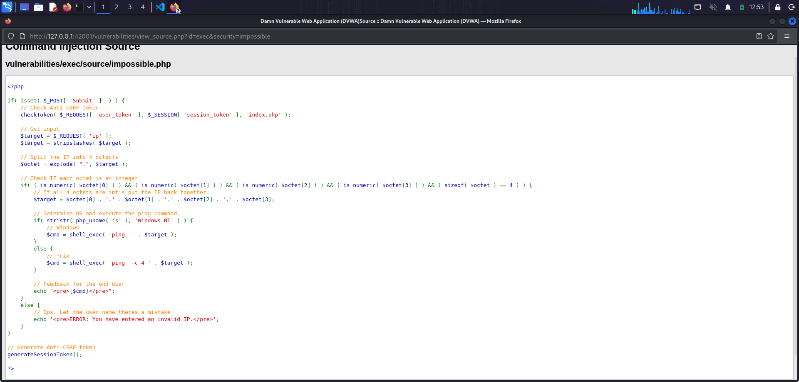
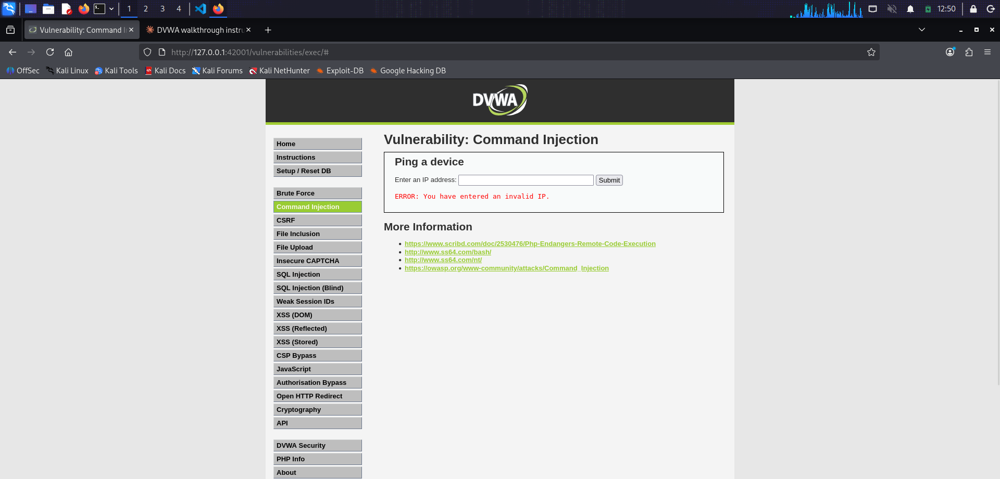

# Command Injection

**Location:** `http://127.0.0.1:42001/vulnerabilities/exec/`

## What the page does

The page presents a form that asks for an IP address. On submission, the server runs `ping -c 4 <input>` and prints the raw output. When the input is passed to a shell without validation, an attacker can append their own shell commands and have them executed with the privileges of the web server.

## Setup

DVWA is running locally on Kali at port 42001. All exercises were performed against the local instance with Burp Suite recording the traffic. The security level was changed between runs from the **DVWA Security** page.

---

## Low

### Source

The input is read from `$_REQUEST['ip']` and concatenated straight into `shell_exec('ping -c 4 ' . $target)`. Nothing is filtered, nothing is escaped, and the resulting shell command is executed as the web server user.

### Payload

`127.0.0.1 ; whoami ; cat /etc/passwd`

### Result

The response contains three blocks stitched together: the ping to 127.0.0.1, the output of `whoami` (which returns `_dvwa`, the user the web server runs as), and the contents of `/etc/passwd`. The semicolon terminates the ping command and lets the shell run everything after it.

### Why it works

The shell interprets `;`, `|`, `&&`, and other control characters as command separators. Because the input is dropped into the command line unmodified, anything the shell recognizes as a separator lets an attacker append commands of their own.

---

## Medium

### Source

The Medium level introduces a blacklist that removes `&&` and `;` from the input via `str_replace`. Only two separators are removed, and the replacement runs once rather than recursively. Everything else, including `|`, `||`, `&`, backticks, and `$()`, still reaches the shell.

### Attempt with the Low payload

`127.0.0.1 ; whoami`

The response is empty. `str_replace` stripped the `;`, so the shell tried to run `ping -c 4 127.0.0.1 whoami`. `ping` treated `whoami` as a hostname argument, could not resolve it, and produced no visible output. The filter neutralized the injection for that specific payload.

### Bypass payload

`127.0.0.1 | whoami`

### Result

The response contains `_dvwa`. The pipe is not on the blacklist, so it reaches the shell intact. The shell pipes the ping output into `whoami`, which ignores its input and prints the current user.

### Why it works

A blacklist can only block the characters its author thought to include. Because only `&&` and `;` are on the list, any other shell separator is a valid bypass. The lack of recursive replacement also means constructions like `&;&` would collapse into `&&` after one pass, providing a second class of bypass.

---

## High

### Source

The blacklist is expanded to include `&`, `;`, `-`, `$`, `(`, `)`, backtick, `||`, and the two-character sequence pipe-then-space. Most shell separators are now covered. The critical detail is that entry `| ` is a pipe followed by a space, not a bare pipe. A pipe with no trailing character passes the filter untouched.

### Attempt with the Medium bypass

`127.0.0.1 | whoami`

The response is empty. `str_replace` removed the `| ` substring, leaving `127.0.0.1 whoami`, which behaves as before: ping receives an unresolvable hostname and produces no output.

### Bypass payload

`127.0.0.1 |whoami`

### Result

The response contains `_dvwa`. Removing the space after the pipe means the filter pattern `| ` no longer matches. The pipe reaches the shell, which pipes the ping output into `whoami` as in the Medium bypass.

### Why it works

The blacklist entry is more specific than the developer intended. A single space in the pattern turns a broad rule into a narrow one, and the narrower version misses the exact case the rule was meant to block. This is the general failure mode of blacklists: the author has to imagine every valid form of the attack in advance, and any form they miss becomes the bypass.

---

## Impossible

### Source

The Impossible level abandons the blacklist entirely and validates the structure of the input instead. It strips slashes, splits the input on `.` into exactly four parts, requires each part to be numeric, and only then reassembles the IP from the verified parts and passes it to `ping`. An anti-CSRF token is also required on submission.

### Attempt with the High bypass

`127.0.0.1 |whoami`

The response is `ERROR: You have entered an invalid IP.` The pipe and command portion break the split, `is_numeric` fails, and the command is never constructed.

### Why it works

Nothing in the input is treated as a shell fragment. The validator asks a positive question about the shape of a valid IPv4 address rather than a negative one about known-bad characters. Only inputs that pass the positive check are allowed through, and by the time the string reaches `shell_exec` it has been rebuilt from four validated numbers rather than passed on from the user.

---

## Takeaways

1. Never concatenate user input into a shell command. If the design absolutely requires shelling out, use escape functions like `escapeshellarg` and validate the input first.
2. Blacklists are the wrong tool for this problem. Every level below Impossible in this exercise fails because the developer tried to enumerate bad input rather than describe good input. The Medium filter missed most separators. The High filter missed one character variation. The Impossible level succeeds by only accepting a specific, well-defined structure.
3. Web server context matters. All commands ran as `_dvwa`, the account the web server uses. On a real server, that account often has read access to configuration files, application code, database credentials, and other assets that turn a command injection into a full compromise.
