# File Inclusion (LFI and RFI)

**Location:** `http://127.0.0.1:42001/vulnerabilities/fi/`

## What the page does

The page reads a filename from the `page` query parameter and calls PHP's `include()` on it. If the file exists on disk, its contents are inserted into the page and PHP files execute inline. When the parameter is not validated, `include()` accepts any path the attacker supplies, which turns into:

- **Local File Inclusion (LFI):** any file on the server's filesystem readable by the web user, including `/etc/passwd`, application source, and configuration files.
- **Remote File Inclusion (RFI):** any URL under the attacker's control, which would execute their PHP on the target server. RFI requires `allow_url_include=On` in `php.ini`, which is off by default on modern installs. The banner at the top of the DVWA page confirms this is disabled on this install, so all exploits below focus on LFI.

Two extra techniques are used throughout:

- **PHP filters** (`php://filter/convert.base64-encode/resource=...`) let the attacker read PHP source without executing it. `include()` normally runs PHP and prints only what the script outputs. The filter base64-encodes the file before it comes back, so the raw source is preserved.
- **The `file://` URL wrapper** reads a local file by absolute path and returns its raw contents, even for PHP files.

## Setup

DVWA running locally on Kali at port 42001. All exercises performed while logged in as admin. Security level changed between runs from the **DVWA Security** page. `allow_url_include` is off on this install, so RFI is skipped and all payloads below are LFI.

---

## Low

### Form

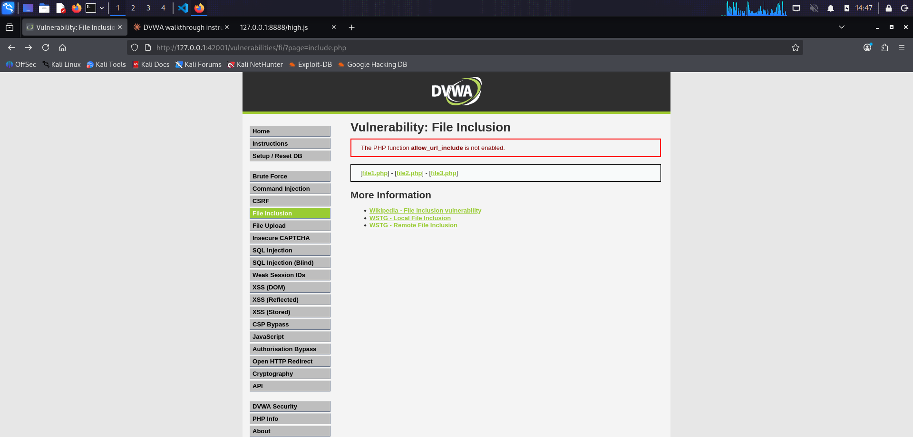

Three links: `file1.php`, `file2.php`, `file3.php`. Clicking one loads `?page=fileN.php`. The URL bar shows the parameter is user-controlled.

### Normal file load

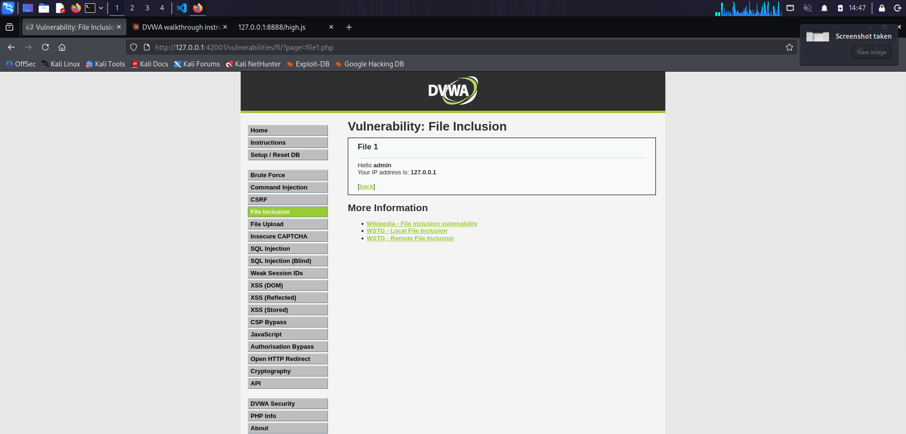

`?page=file1.php` shows a page with "Hello admin" and the user's IP address. Standard usage.

### Source

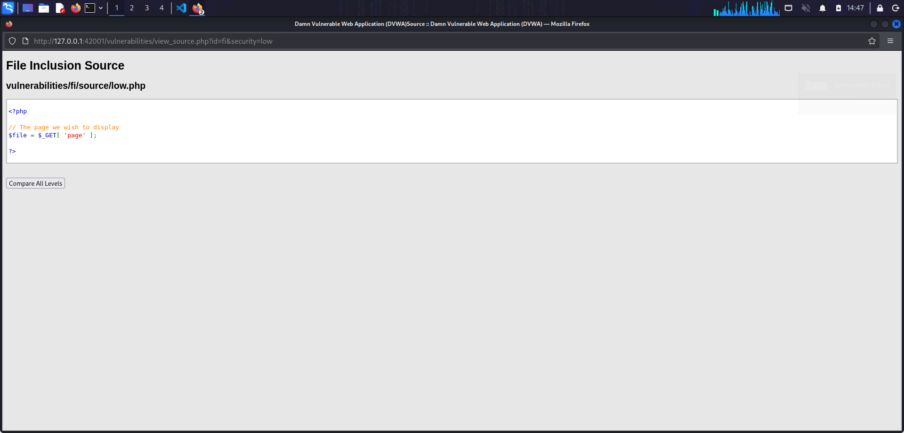

The handler is one line: `$file = $_GET['page']`. No filter, no validation, no allowlist. Whatever the user puts in the query string becomes the argument to `include()`.

### Payload 1: read /etc/passwd

`http://127.0.0.1:42001/vulnerabilities/fi/?page=../../../../../../etc/passwd`

Six `../` sequences walk up from the include directory to the filesystem root. Any `..` at `/` is a no-op, so extras are harmless.

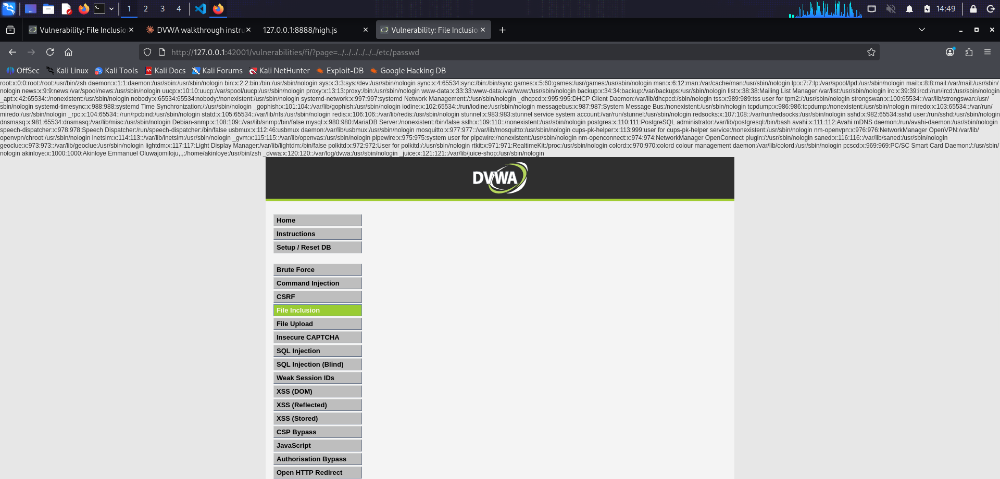

The response contains the full `/etc/passwd` file rendered above the DVWA sidebar, exposing every account on the system.

### Payload 2: read PHP source via php:// filter

`http://127.0.0.1:42001/vulnerabilities/fi/?page=php://filter/convert.base64-encode/resource=../../login.php`

Requesting `login.php` directly would execute it and return only its rendered output. Wrapping the request in `php://filter/convert.base64-encode/resource=...` base64-encodes the file contents before returning them, so the raw source comes back as an inert string.

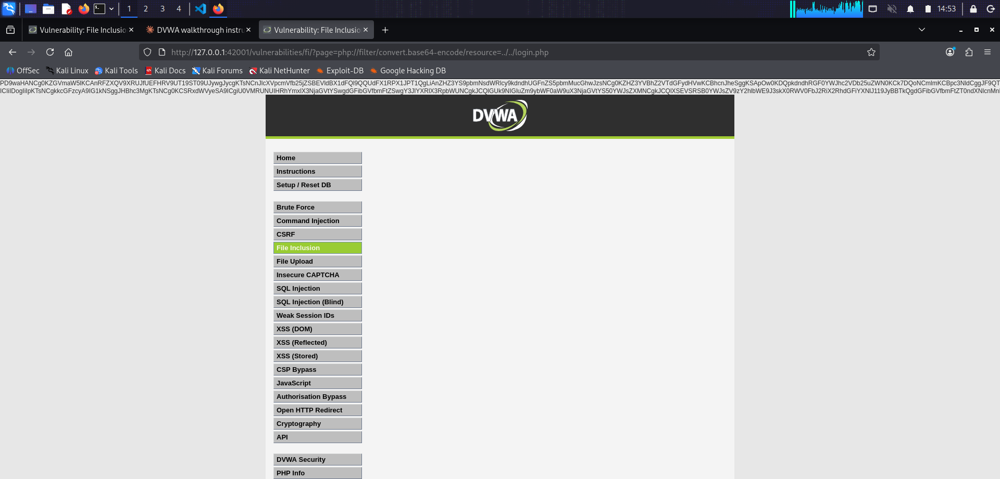

The response is a long base64 blob rendered on the page.

### Decoded source

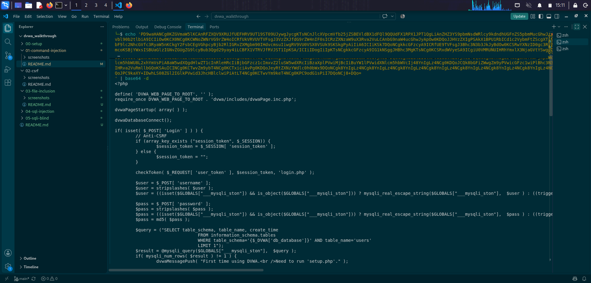

Decoding the blob with `base64 -d` prints the actual PHP source of `login.php`, including the anti-CSRF token check, the input escape logic, the MD5 password hashing, and the SQL query that authenticates the user. In a real attack this would expose credentials, database strings, and every security control the application relies on.

### Why it works

`include()` reads any path the caller supplies. When the caller is the user, the user chooses which file. Without a check that constrains the input to expected values, the include statement becomes a universal file-read primitive against everything the web user can access on disk.

---

## Medium

### Source

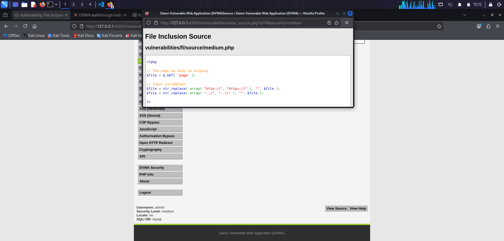

Medium adds two `str_replace` calls that run once each:

- `str_replace(array("http://", "https://"), "", $file)` strips the URL schemes to block RFI.
- `str_replace(array("../", "..\\"), "", $file)` strips the traversal sequences to block LFI.

Neither runs recursively. Each takes one pass through the string and stops.

### Attempt with the Low payload

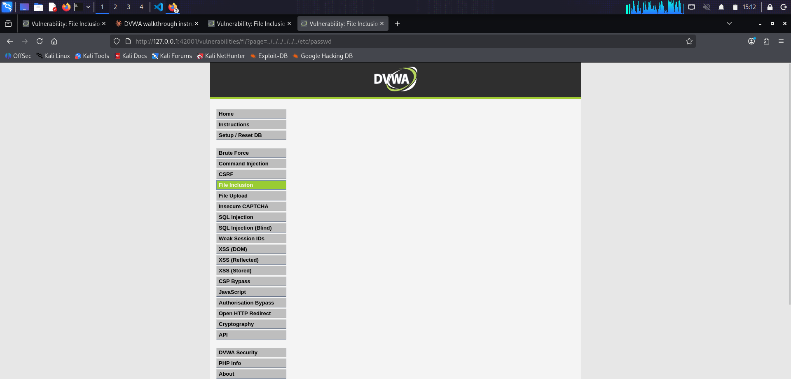

Requesting `?page=../../../../../../etc/passwd` returns just the DVWA sidebar with no file contents. The `../` sequences were all stripped, leaving `etc/passwd`, which cannot be found from the include directory.

### Bypass: doubled traversal sequence

`http://127.0.0.1:42001/vulnerabilities/fi/?page=....//....//....//....//....//etc/passwd`

Each `....//` becomes `../` after the filter runs. The string `....//` contains one `../` sandwiched between two dots and a slash. `str_replace` removes the middle `../` on its one pass, and what remains, `../`, is a valid traversal sequence.


The full `/etc/passwd` is dumped again, reached through the exact same include as Low but with a doubled sequence that survives one-pass filtering.

### The PHP filter bypass

`http://127.0.0.1:42001/vulnerabilities/fi/?page=php://filter/convert.base64-encode/resource=....//....//login.php`

Same trick applied to the filter payload. The `resource=` parameter needs traversal to reach `login.php`, and `....//` slips through.

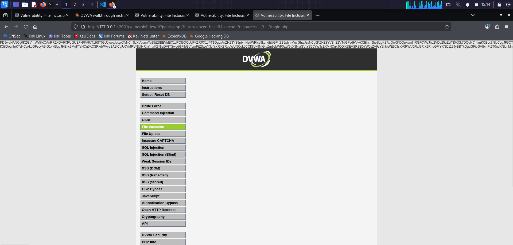

The base64 blob returns identical to the Low leak.

### Why it works

A single-pass string replacement cannot handle patterns that the replacement itself creates. As long as the filter runs once, the attacker only has to write an input that reduces to the forbidden pattern after one substitution. Recursive replacement would solve this specific case, but even then the attacker could reach for other bypasses (URL encoding, different traversal characters, absolute paths). Blacklisting patterns in filename strings is a losing game.

---

## High

### Source

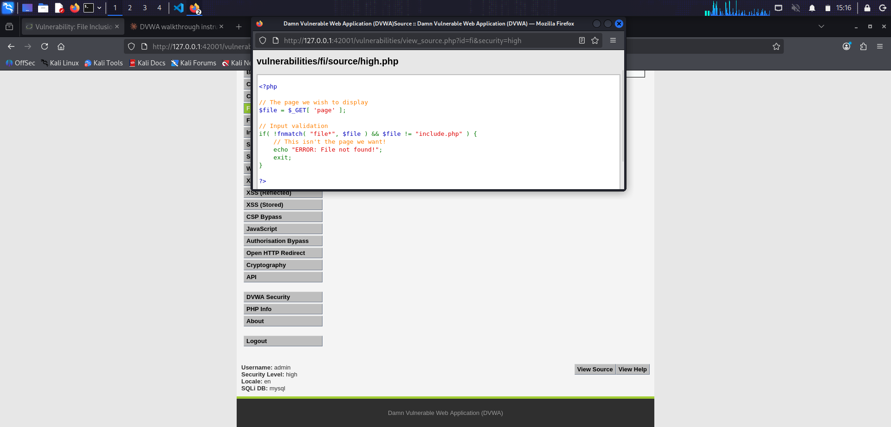

High switches strategy: instead of stripping bad patterns, it allowlists filenames that start with `file`. The check is:

```php
if( !fnmatch("file*", $file) && $file != "include.php" ) {
    echo "ERROR: File not found!";
    exit;
}
```

`fnmatch("file*", $file)` returns true if `$file` starts with the literal string `file`. `include.php` is allowed explicitly. Everything else is rejected outright.

### Attempt with the Medium bypass

`http://127.0.0.1:42001/vulnerabilities/fi/?page=....//....//....//....//....//etc/passwd`

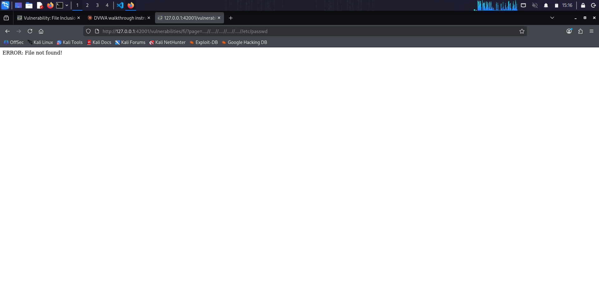

The response is `ERROR: File not found!`. The input starts with `....//`, not `file`, so `fnmatch` returns false and the handler exits before the include runs. The Medium bypass is dead here.

### Bypass 1: prefix with `file` then traverse

`http://127.0.0.1:42001/vulnerabilities/fi/?page=file/../../../../../../etc/passwd`

The whitelist only checks the beginning of the string. Everything after the first `file` is unconstrained. `file/../` walks into a directory named `file` and back out, netting zero directories moved, then the remaining `../` sequences do the actual traversal.


`/etc/passwd` returns just like at Low and Medium.

### Bypass 2: the `file://` URL wrapper reads any file

`http://127.0.0.1:42001/vulnerabilities/fi/?page=file:///etc/passwd`

`file://` is a PHP stream wrapper. It also starts with the string `file`, so it satisfies the whitelist. The three slashes are meaningful: `file://` is the scheme, then `/etc/passwd` is the absolute path.

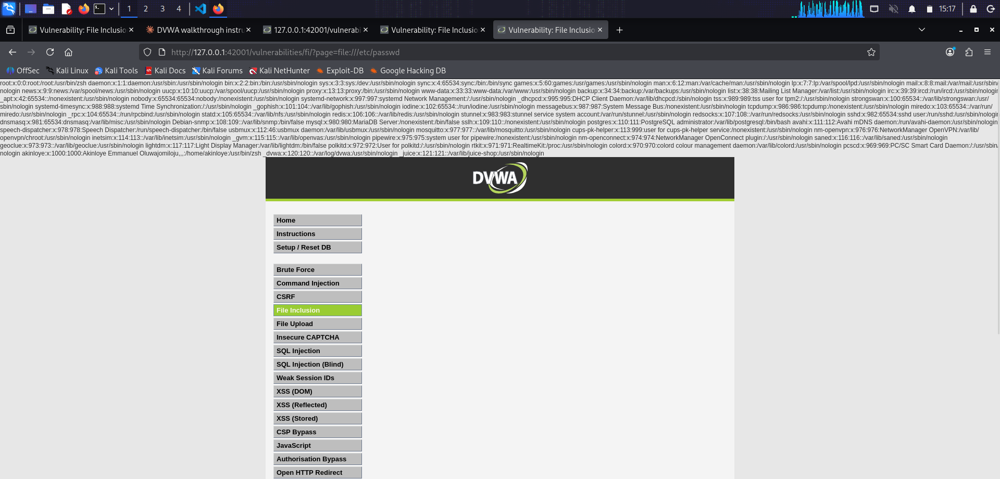

Same passwd dump.

### Bypass 2, extended: read raw PHP source without base64

`http://127.0.0.1:42001/vulnerabilities/fi/?page=file:///usr/share/dvwa/hackable/flags/fi.php`

`file://` returns raw file contents without executing PHP, unlike `include()` which would run the code. So the base64 dance from Low and Medium is unnecessary at High.

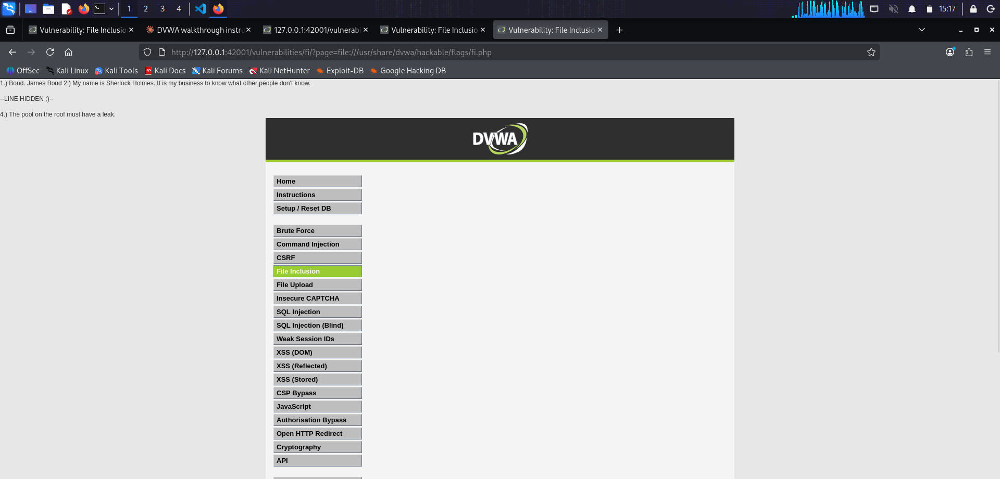

The flag file's actual contents render directly on the page.

### Why it works

`fnmatch("file*", ...)` was intended to allow "files starting with the word file", meaning `file1.php`, `file2.php`, `file3.php`. But the wildcard matches anything after the prefix, and PHP's include machinery accepts URL schemes as filenames. Two problems fell out of one loose check:

1. The prefix only anchors the start of the string. Any traversal sequence after `file/` still works.
2. `file://` is a valid PHP stream wrapper whose scheme starts with the allowed prefix, so the filter cannot distinguish "a filename starting with file" from "a URL scheme starting with file".

The lesson mirrors Command Injection: a pattern that describes what the input looks like at a coarse level is not the same as a check that constrains what the input can do.

---

## Impossible

### Source

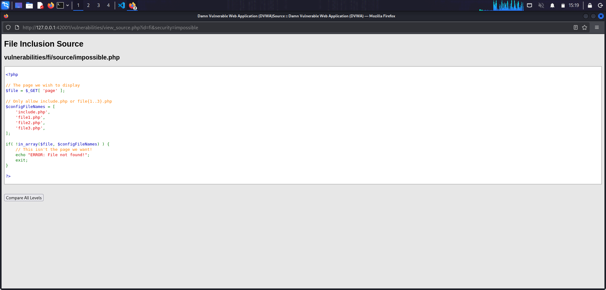

Impossible replaces the pattern match with an exact-string allowlist:

```php
$configFileNames = ['include.php', 'file1.php', 'file2.php', 'file3.php'];
if( !in_array($file, $configFileNames) ) {
    echo "ERROR: File not found!";
    exit;
}
```

Four exact strings. No wildcards, no substring matches, no filter substitutions. An input either matches one of the four exactly or it is rejected.

### Attempt with the High bypass

`http://127.0.0.1:42001/vulnerabilities/fi/?page=file:///etc/passwd`

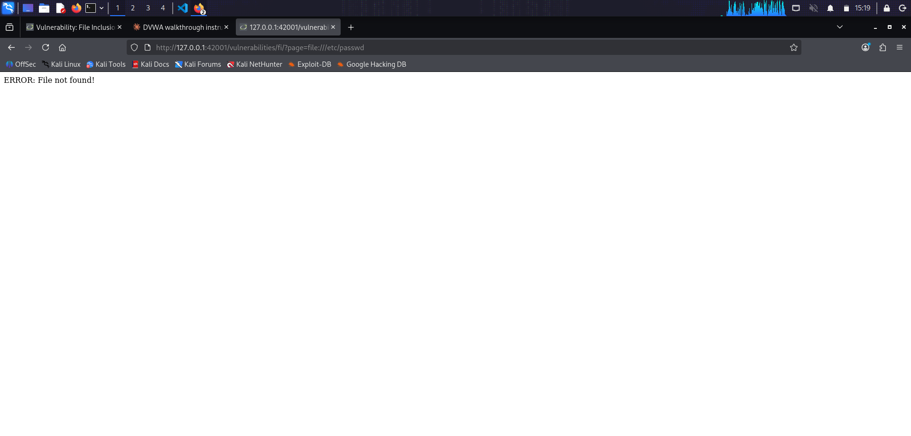

The response is `ERROR: File not found!`. `file:///etc/passwd` is not equal to any of the four allowed strings, so `in_array` returns false and the handler exits.

### Why it works

Nothing about the input is inspected beyond a direct string comparison against a small list of expected values. There is no pattern, no substring, no encoding, no wrapper, and no clever traversal that turns any of the four allowed strings into something else. The attacker's input space collapses to four legitimate options, none of which read anything the developer did not intend.

---

## Takeaways

1. **Never pass user input to `include()`, `require()`, or any function that resolves paths and runs code.** If dynamic includes are unavoidable, the input must be an index into a server-side allowlist, not the filename itself.
2. **Blacklisting traversal sequences is fragile.** Single-pass replacement is defeated by doubled sequences, recursive replacement is defeated by URL encoding or absolute paths, and every additional filter adds complexity without closing the hole. The Impossible fix is dramatically simpler than either Medium or High and dramatically safer.
3. **`fnmatch` and prefix checks are not allowlists.** A pattern that matches many strings, including strings the developer never considered, is not a whitelist. It is a permissive filter with a whitelist-shaped name.
4. **PHP stream wrappers (`file://`, `php://filter/`, `data://`, `expect://`, `phar://`) turn any file-inclusion vulnerability into more than a file read.** Even when RFI is disabled, wrappers let the attacker read PHP source, decode data, and in some configurations execute arbitrary code. Any include of user input is a foothold, not a bug to patch in place.
