# SQL Injection

**Location:** `http://127.0.0.1:42001/vulnerabilities/sqli/`

## What the page does

The page presents a form that asks for a User ID and returns the corresponding user's first and last name. On the server the input is stitched into a SQL query like `SELECT first_name, last_name FROM users WHERE user_id = '$id';`. When the input is inserted into the query text without separation from the SQL syntax, the attacker can close the string with a quote and inject their own SQL clauses. Two common goals apply here:

1. Dump every row by making the WHERE clause always true, using a payload like an OR condition that is always true.
2. Extract data from other columns by attaching a UNION SELECT that reads whatever the attacker wants, most usefully the password hashes.

The DVWA users table stores usernames, first and last names, and MD5 password hashes with no salt. MD5 without a salt is broken for password storage: the hashes for common passwords are precomputed and searchable in seconds. Every hash the UNION payload exposes below has been in public rainbow tables for years.

## Setup

DVWA running locally on Kali at port 42001. All exercises performed while logged in as admin. Security level changed between runs from the DVWA Security page. The hash character is used as the SQL comment in payloads because MySQL treats it as a comment without needing a trailing space (unlike the double-dash which requires the space).

---

## Low

### Form

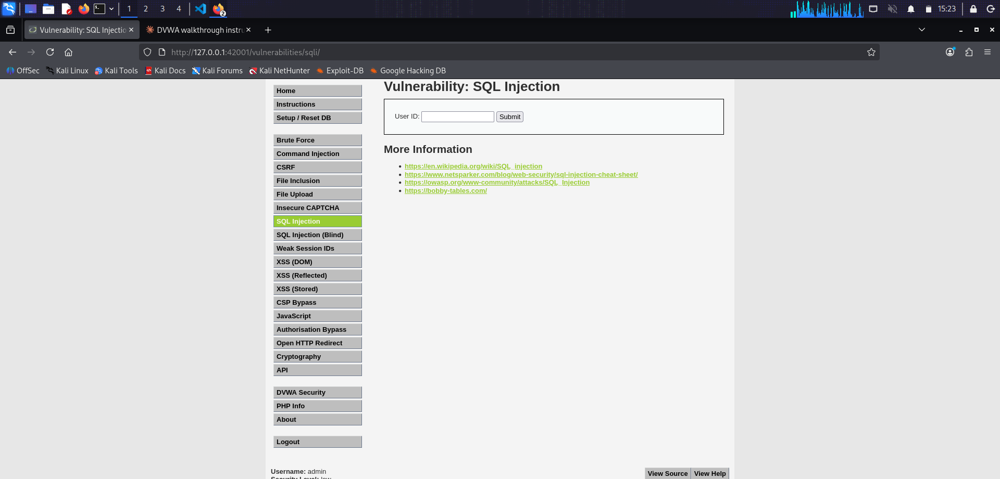

Text input for the User ID and a Submit button.

### Normal lookup

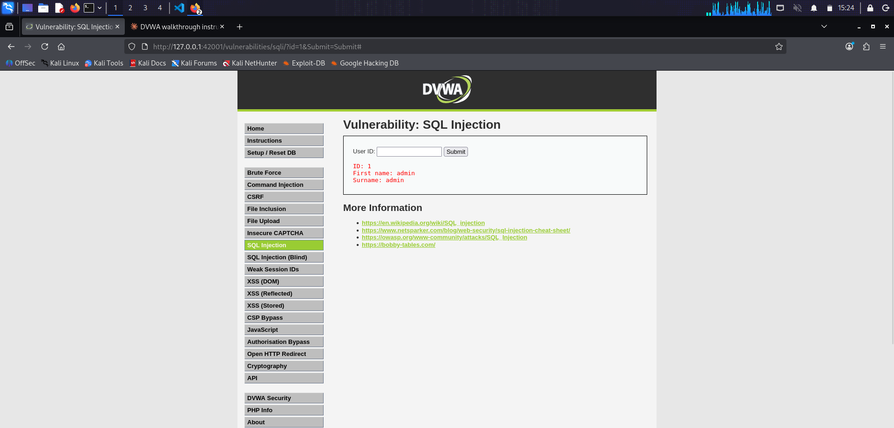

Entering the value 1 returns ID: 1, First name: admin, Surname: admin. One row, as intended.

### Source

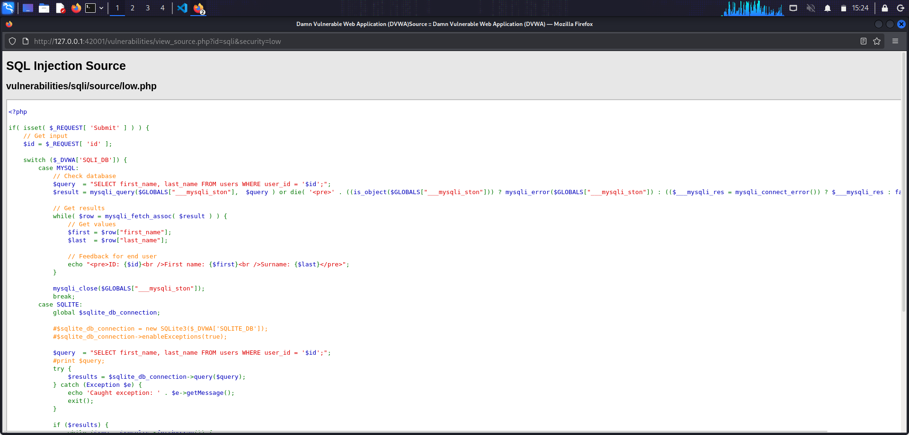
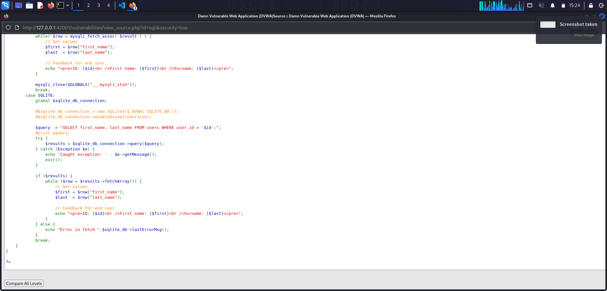

The handler reads the id request parameter and drops it directly into the query. The id is concatenated between single quotes into a SELECT statement against the users table. No escaping, no bound parameters, no type coercion.

### Payload 1: dump every row

The payload closes the opening quote around the id, adds an OR condition that is always true, and comments out the closing quote the server appends.

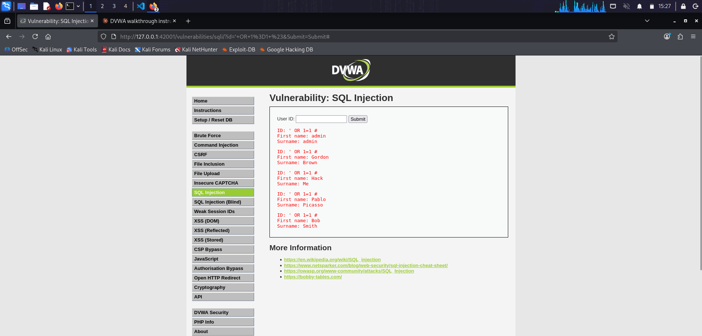

All five users returned in a single response: admin, Gordon Brown, Hack Me, Pablo Picasso, Bob Smith. The WHERE clause now matches every row instead of a single id.

### Payload 2: dump password hashes via UNION

The payload attaches a UNION SELECT that reads the user and password columns from the same users table, and comments out the trailing quote.

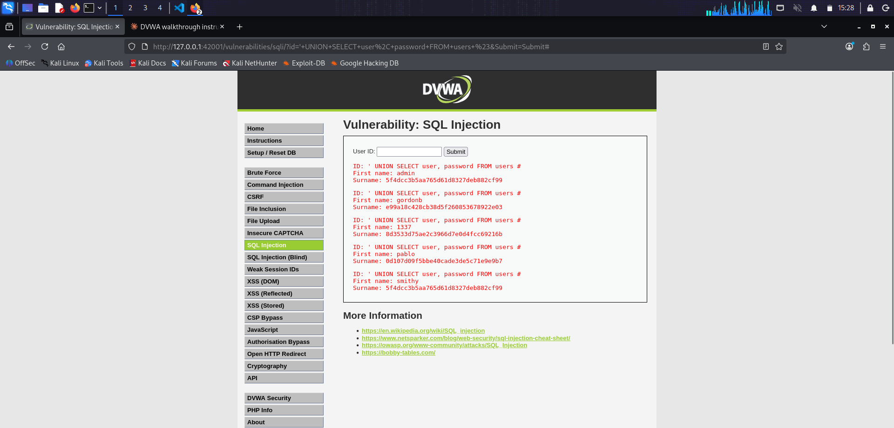

The response contains the previous rows plus each username paired with its MD5 hash in the Surname field. The two SELECT statements have to return the same number of columns for UNION to work, so the payload picks two columns (user and password) that match the original two (first_name and last_name).

The five hashes reverse to the following passwords:

- admin and smithy: password
- gordonb: abc123
- 1337: charley
- pablo: letmein

All five are in public rainbow tables and crack in milliseconds.

### Why it works

The query is a single string built by concatenation. The database driver has no way to tell where the developer's SQL ends and the user's input begins, because at the point the driver sees the query, there is no distinction. Any input that contains SQL syntax is treated as SQL syntax.

---

## Medium

### Form

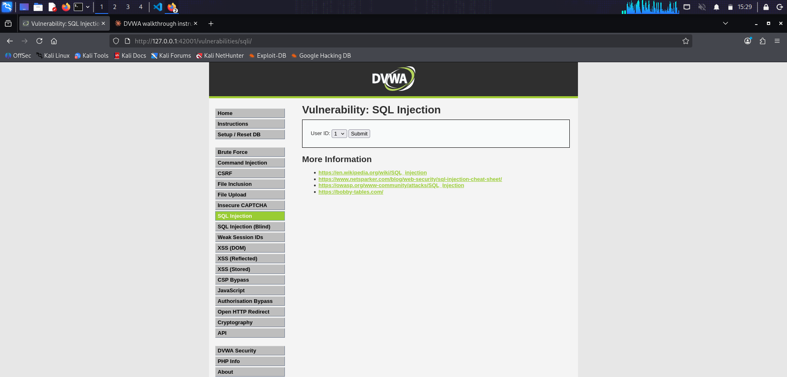

The text input becomes a dropdown with values 1 through 5. This is client-side only; any HTTP client (browser dev tools, curl, Burp) can send any value the attacker wants.

### Source

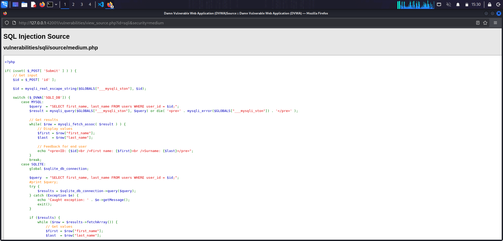
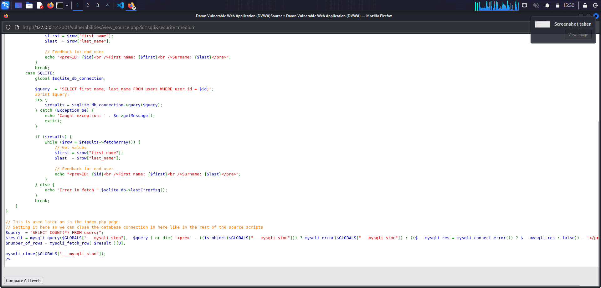

Two changes from Low. The id is now passed through mysqli_real_escape_string, which escapes quotes and a few other characters. The real weakness is on the next line: the query has no quotes around the id. It is a numeric context. An escape function that escapes quotes does nothing when there are no quotes to escape.

### Normal lookup

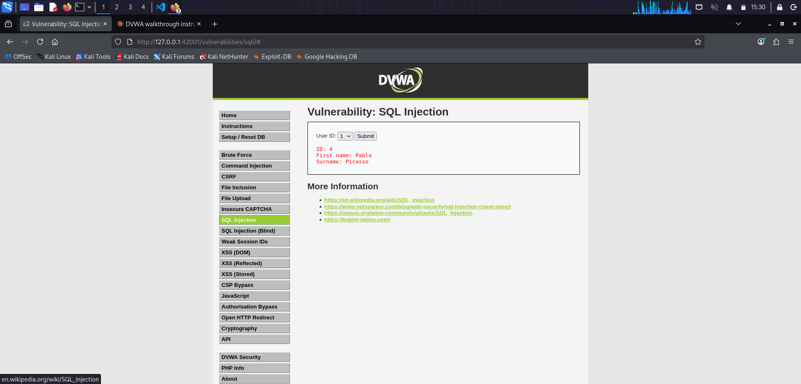

Selecting an ID from the dropdown and submitting returns the expected single row.

### Bypass with curl

Because the input is submitted as POST and the form only offers 1 through 5, the cleanest way to inject is with curl. The session cookie is copied from the browser's dev tools (Storage tab, Cookies, PHPSESSID). The payload is sent as the value of the id form field, url-encoded so it survives the POST body.

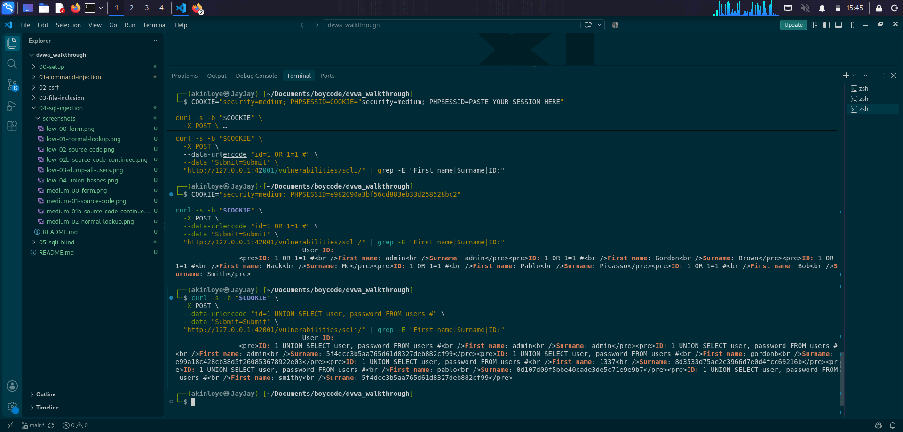

Both the always-true payload and the UNION payload return the full set of rows and the full set of hashes. Medium's escape function did not block either.

### Why it works

The mysqli escape function was designed to make quoted string literals safe. The query at Medium does not quote its parameter, so the payload does not need to escape a quote to break out of anything. The concatenated query becomes valid SQL syntax the moment the substitution happens: the server sees a WHERE clause with an always-true condition, which is a legal query that matches every row.

The dropdown was a distraction. HTML-level input constraints run in the user's browser, and the attacker controls the browser (or bypasses it entirely with curl).

---

## High

### Form

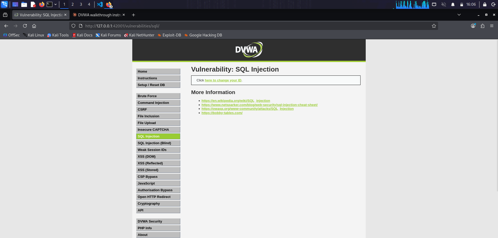

The form is now a single link that opens a popup for the ID input, storing it in the session before the main page runs the query.

### Popup

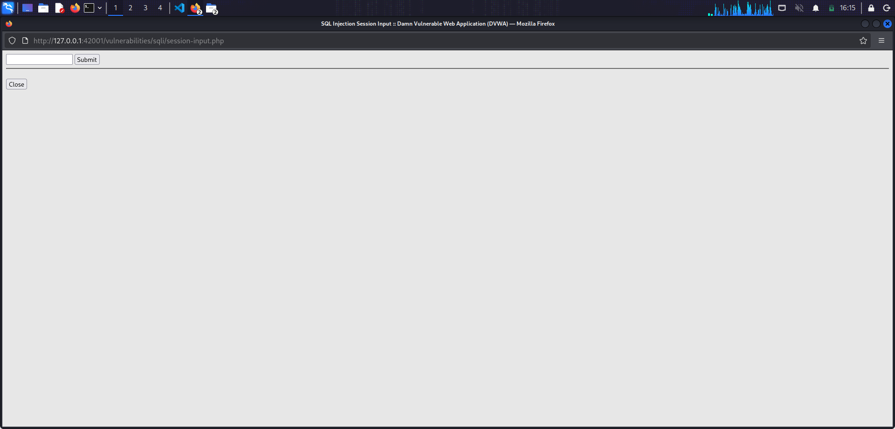

A small window with a text field. Submitting stores the value in the session.

### Source

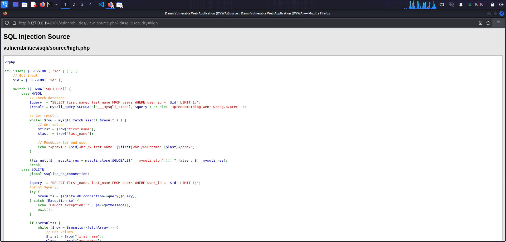
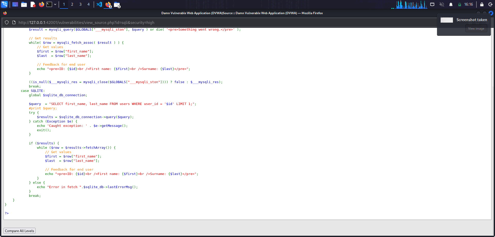

Two changes from Medium. The value comes from the session rather than a request parameter, and the query has LIMIT 1 appended. Neither change alters what SQL injection can do. Moving the input into a session variable adds one HTTP request to the attacker's workflow but does not sanitize anything. LIMIT 1 restricts the number of rows returned, but the attacker's payload can comment it out before the database ever sees it.

### Payload

The UNION SELECT payload is submitted through the popup. The trailing comment operator comments out both the closing quote and the LIMIT 1 clause, leaving a query that returns every row from the users table with their password hashes.

After submitting the popup and reloading the main SQLi tab, all five usernames and hashes appear.

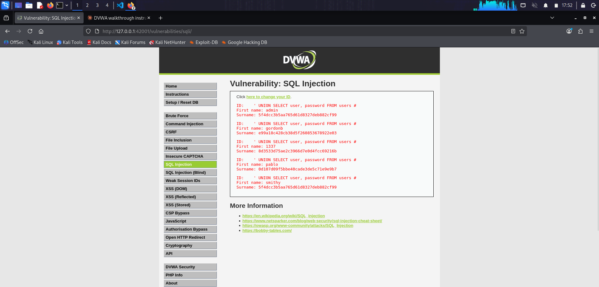

Same data as Low and Medium. The two-step input flow added no defense.

### Why it works

Splitting input handling across two requests does not sanitize anything. The session variable holds whatever the popup accepted, and that value is concatenated into the query the same way Low and Medium concatenated their request parameters. LIMIT 1 is inside the query string, downstream of the injection point, so anything that can inject SQL can also comment it out.

The pattern of moving user input into a session and adding a query modifier is common in real applications that try to retrofit safety onto vulnerable code without rewriting the queries. It never works, because the bug is not where the input comes from, it is that the input is being pasted into SQL text.

---

## Impossible

### Form

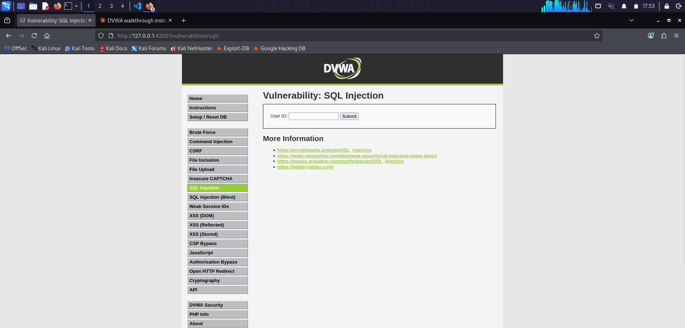

The form is back to a text input and Submit button. What changes is entirely on the server.

### Source

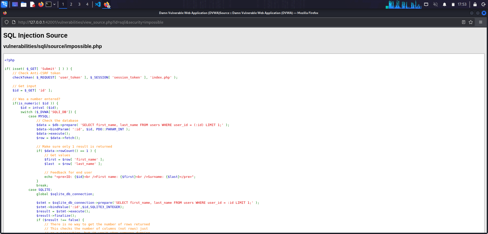
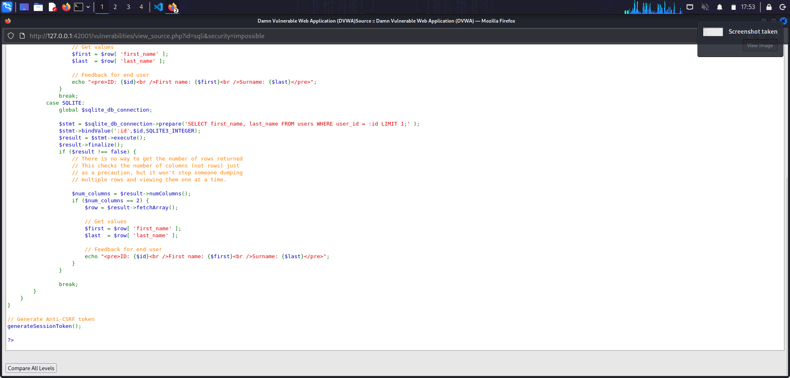

Impossible uses PDO prepared statements with bound parameters, plus an integer coercion and a type check. Three things work together:

1. is_numeric rejects anything that is not a number before the query runs at all.
2. intval coerces the accepted input to an integer, discarding any trailing characters.
3. The prepared statement sends the query and the parameter to the database separately, with the PDO integer type telling the driver to bind it as an integer. The database receives the query template once and the parameter as pure data, never as SQL.

An anti-CSRF user_token is also checked at the top of the handler, which stops forged requests from other pages triggering the query at all.

### Attempted attack

Submitting the UNION SELECT payload from High through the Impossible form:

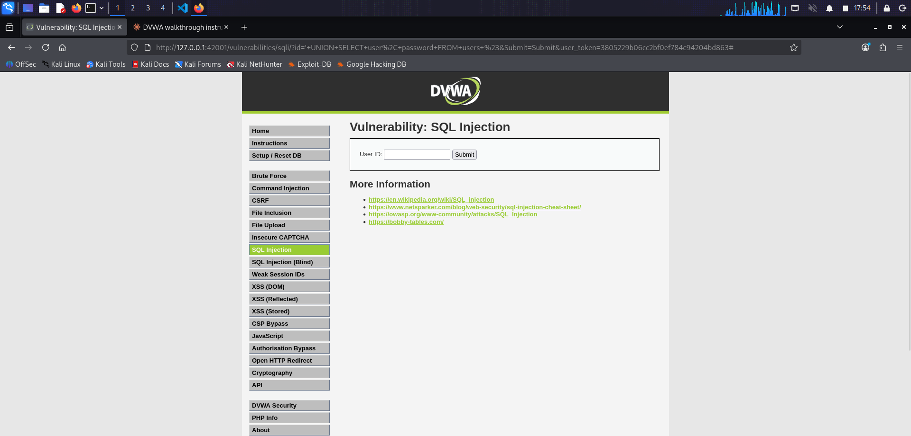

The URL bar shows the payload was submitted with a valid CSRF token, but the results section is empty. is_numeric returned false because the input starts with a quote, and the handler exited before reaching the query. Even if the check had been bypassed, the prepared statement would have treated the string as data, not SQL, and no matching row would exist for a user_id of that string.

### Why it works

Prepared statements separate code from data at the protocol level. The query template travels to the database once with placeholders. The parameters travel separately, tagged with their types. The database engine parses the query template into an execution plan without ever seeing the parameter values, then plugs the values in during execution as pure data. There is no string in which SQL and user input coexist, so there is nothing to escape and no boundary to break out of.

The type coercion and is_numeric check are belt-and-braces: even a bug elsewhere in the parameter handling would not let a string reach the query, because the code refuses to run on non-numeric input.

---

## Takeaways

1. Never concatenate user input into a SQL query. Prepared statements with bound parameters are the only reliable defense against SQL injection. Every level below Impossible in this exercise fails because the query is a string that the developer built with user input in the middle of it.
2. Escape functions are not a substitute for prepared statements. The mysqli escape function was designed for one specific case (quoted string literals in queries), and Medium demonstrates that the defense collapses the moment the parameter is used in any other context. Even in the case it was designed for, a single missing quote in the query template is enough to make the escape a no-op.
3. Client-side input constraints are cosmetic. The Medium dropdown limits what a user with a browser can pick, but the attacker is not limited to a browser and, even in a browser, dev tools and interception proxies let them send whatever they want.
4. UNION SELECT is why one SQL injection is often a total compromise. Once the attacker can inject SQL, they are not limited to the data the vulnerable query was meant to return. UNION lets them read any table the database user has access to, including tables like users where credentials are stored.
5. Unsalted MD5 for password storage is malpractice. Every hash extracted in this exercise reverses to a common word in a rainbow-table lookup that takes milliseconds. Modern password storage uses adaptive functions like bcrypt, scrypt, or Argon2 with per-user salts, so that even if the database is dumped the attacker cannot mass-crack the hashes.
